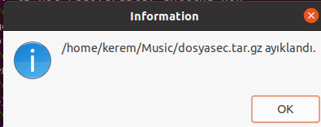
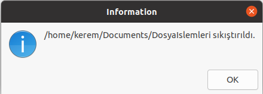

# Tar Komutu Görsel Arayüzü

Linux Araçları ve Kabuk Programlama için yapılmış bir projedir.

## Proje
tar komutunun bazı parametreleri için zenity ile görsel bir arayüz oluşturulmuştur.
Dosya sıkıştırma ve ayıklama işlemleri yapılabilmektedir.

# Teknolojiler
- Bash Script
- Zenity

# Kurulum
## Github üzerinden indirmek

1) Repository sayfasındaki Code -> Download Zip kısmından zipi indirin.
2) Zipten çıkarın.
3) Zipten çıkarılmış klasorde terminali açın.
4) Terminalde "bash DosyaIslemleri.sh" komutunu çalıştırın.

## Git Üzerinden İndirmek ve Calistirmak
  Terminale aşağıdaki komutları sırasıyla girin.
- git clone https://github.com/keremersu35/TarWithZenity.git
- cd TarWithZenity
- bash DosyaIslemleri.sh

# Ekran Görüntüleri

Dosya sıkıştırma ve dosya ayıklama işlemlerinden biri seçilir.

Kullanıcı ayıklama işlemini seçtiğinde böyle bir ekranla karşılaşır ve ayıklamak istenen dosya seçilir.

Ayıklama işlemi yapıldıktan sonra kullanıcı bilgilendirilir.

Kullanıcı sıkıştırma işlemini seçtiğinde böyle bir ekranla karşılaşır ve sıkıştırılmak istenen dosya seçilir.

Sıkıştırma işlemi yapıldıktan sonra kullanıcı bilgilendirilir.
